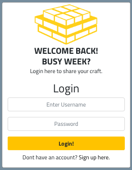
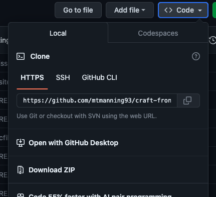

# Craft Social

## Intro

Craft Social is a social platform where tradesmen and skilled workers can share
work related content. Showcasing their skills and abilities. It is designed to
highlight good skills through the approval of people within the industry.

This repository is for the Craft Social frontend. The application also utilizes
a backend API using Django Rest Framework, the repository for this can be found
at [Craft-API](https://github.com/mtmanning93/craft-api).

### Live Site

[Hosted on Heroku](https://craftltd-6c672c6a814e.herokuapp.com/)

### Repository

[Github Repository](https://github.com/mtmanning93/craft-front)

### Project Stack

React, React-Bootstrap, JSX, CSS, HTML, axios

### Get Started

To get started follow these steps to clone the github repository locally, and
setup other dependencies:

[Deployment](#deployment)

## Contents

-   [Craft Social](#craft-social)
    -   [Intro](#intro)
        -   [Live Site](#live-site)
        -   [Repository](#repository)
        -   [Project Stack](#project-stack)
        -   [Getting Started](#get-started)
    -   [Design Thinking](#design-thinking)
        -   [Problem ID](#problem-id)
        -   [Problem Statement](#problem-statement)
        -   [Design Thinking](#design-thinking)
    -   [UX](#ux-user-experience-design)
        -   [User Stories](#user-stories)
            -   [Site Admin](#site-admin)
            -   [User](#user)
            -   [Registered User](#registered-user)
        -   [Wireframe](#wireframe)
        -   [Information Architecture](#information-architecture)
        -   [Visual Design](#visual-design)
            -   [Color Scheme](#color-scheme)
            -   [Fonts](#fonts)
            -   [Icons](#icons)
            -   [Logo](#logo)
    -   [Database ERD](#database-erd)
    -   [Development](#deployment)
        -   [Agile Design](#agile-design)
            -   [Github Issues](#github-issues)
                -   [Templates](#templates)
                    -   [User Story Template](#user-story-template)
                    -   [Bug Report](#bug-report)
                    -   [Feature Request](#feature-request)
                -   [Labels](#labels)
            -   [Product Backlog](#product-backlog)
            -   [Iterations](#iterations)
                -   [Backend Iteration](#backend-iteration)
            -   [Kanban Board](#kanban-board)
    -   [Features](#features)
        -   [Current Features](#current-features)
            -   [Landing Page](#landing-page)
            -   [Sign Up Form](#sign-up-form)
            -   [Login Form](#login-form)
            -   [Navbar](#navbar)
            -   [Header](#header)
            -   [Work Of The Week](#work-of-the-week-wotw)
            -   [Discover Feed](#discover-feed)
            -   ['Feed' Feed](#feed-feed)
            -   [Liked Feed](#liked-feed)
            -   [Top Feed](#top-feed)
            -   [Search Bar](#search-bar)
            -   [Create Post](#create-post-form)
            -   [Edit Post](#edit-post-form)
            -   [Delete Objects](#delete-objects)
            -   [Post Details Page](#post-details-page)
                -   [Likes](#liking)
                -   [Comments](#commenting)
            -   [Profile Page](#profile-page)
                -   [Follow](#follow)
                -   [Approve](#approve)
            -   [Update Profile](#update-profile)
                -   [Select Employer](#select-employer)
                -   [Add/ Edit Company](#add-edit-company)
            -   [Account Credentials](#account-credentials)
        -   [CRUD Functionality](#crud-functionality)
        -   [Future Features](#future-features)
    -   [Reusable Components](#reusable-components)
        -   [BackButton.js](#backbuttonjs)
        -   [MainButton.js](#mainbuttonjs)
        -   [SettingDropdown.js](#settingsdropdownjs)
        -   [InfiniteScroll.js](#infinitescrolljs)
        -   [Loader.js](#loaderjs)
        -   [ErrorAlert.js](#erroralertjs)
        -   [Avatar.js](#avatarjs)
        -   [ConfirmationModal.js](#confirationmodaljs)
        -   [Post.js](#postjs)
        -   [Comment.js](#commentjs)
    -   [Contexts/ Hooks]()
    -   [Libraries/ Dependencies](#libraries-and-dependencies)
    -   [Testing](testing.md)
    -   [Bugs](#bugs)
        -   [Resolved Bugs](#resolved-bugs)
        -   [Unresolved Bugs](#unresolved-bugs)
    -   [Deployment](#deployment)
        -   [Github Cloning](#github-cloning)
        -   [Heroku Deployment](#heroku-deployment)
    -   [Credits](#credits)
        -   [Tools](#tools)
        -   [Resources](#resources)
        -   [Tutorials](#tutorials)

## Design Thinking

### Problem ID
---

For a tradesman there isnt a place for to share work. Instagram and Facebook are
catered more to 'free-time' social activities. It would be beneficial to have
platform to share work and related information with other like minded people who
can appreciate it. Tradesman and manual workers are often very skilled
individuals, their work is often taken for granted as they have knowhere to
share it.

### Problem Statement
---

"As a _skilled tradesman_, I would like to have _a place to share work I am
proud of_ or updates on a particular project, but I dont know where to share
work related content. Instagram is too social, and LinkedIn seems too corporate.
This makes me feel _my work is not getting seen or appreciated_ like other
industries. Where can I share content, to _showcase my skills_ for others to
appreciate it."

### Site Goals
---

**User Goals** - The user wants the ability to share work and work related
updates via a post, to a site with like minded individuals, showcasing their
craft and abilities.

**Owner Goals** - To create an environment for people in highly skilled manual
jobs to share their work, showcase their skills and have their work appreciated.

### Brainstorm
---

After establishing the site goals, A brainstorming session was carried out. Many
ideas were written down and the final brainstorm sheet took the best ideas
discussed together, for better clarity during the build. Below is the final
sheet.

[⏫ contents](#contents)

## UX/ User Experience Design

### User Stories
---

Once the main site functions and goals were decided on, user stories were
created to clarify which tasks must be completed to reach the MVP (minimum
viable product) of the site. Below are a few example user stories. To see all
the user stories completed during the apllications build, and those left within
the product backlog, visit this link
[Craft Project Board](https://github.com/users/mtmanning93/projects/8).

#### Site Admin

> "As a site admin I can control all site content so that I can keep site
> content safe for all users."

#### User

> "As a user I can move through the site easily so that my experience when
> moving through the site is without frustration."
>
> "As a user I can view a list of all posts so that I have an overview of the
> entire site, and can easily select one to view more closely."
>
> "As an unregistered user I can sign up to an account so that I can enjoy the
> benefits of a registered user."
>
> "As a non-registered user I can view the comments left on each post so that I
> can read the conversation."
>
> "As a user I can select a post and read its content so that I can read more
> information about it."

#### Registered User

> "As a registered user I can login to my account so that i can use the
> registered user functions of the site."
>
> "As a registered user I can navigate to the feed which shows all posts from
> users i follow so that I can see what these users are up to easier."
>
> "As a registered user I can view a list of all posts I have liked so that I
> can see my favourite posts."
>
> "As a registered user I can edit a published post so that its contents is how
> I would like."
>
> "As a registered user I can login to my account so that i can use the
> registered user functions of the site."

[⏫ contents](#contents)

### Wireframe
---

To aid in the design of the UI a wireframe was created. The preference was to
create a large wireframe incorporating all pages, to visualise the flow of the
website as well as the design. I provided wireframes for, desktop/ laptop and
mobile devices, along with the deletion confirmation modals.

Line Key:\
**Green** - Creation or Addition\
**Orange** - Action\

[⏫ contents](#contents)

### Information Architecture
---

When building the project's wireframe it was important to take into
consideration the positioning of elements. Across the entire application, the
user will find the consistent layout of a navbar and header above the main
content, and an extra 'Work of the Week' app on the right hand side of the main
feed or object details. Key aspects of the information architecture, found
throughout the site are:

-   **Site Wide Navbar:**\
    The navbar offers the user links to various pages of the site. For non-registered
    users simple 'home', 'login' and 'signup' links. Once logged in the naviation
    shows user related links, such as the main 'Create Report (+)' button and the
    user avatar dropdown. The dropdown for each registered user contains links to
    profile, settings and logout. The consistency of this navigations position aids
    the user in moving easily between user specific parts of the site, contributing
    to a better user experience.

-   **Branding:**\
    Within the navbar is a large site logo, this allows users to quickly identify
    the website and helps establish a visual identity. Its also a 'home' link when
    clicked, offering a return-to-home option wherever the user is in the site.

-   **Header:**\
    The header contains a simple welcome message and extra link to signup for unregistered
    users. For logged in users the header contains links, in the form of tabs, to
    the different feeds of the site, it is consisitently positioned througout the
    application again to enable the user to navigate easily through the feed pages.

-   **Work of the Week:**\
    The extra 'Work of the Week' (WotW) component is consistently positioned to the
    right of the main page details on desktops and at the top under the header for
    mobile devices. As one of the site goals is to hsowcase work this component had
    to be positioned in a clear, easy to locate place throughout the site.

[⏫ contents](#contents)

### Visual Design
---

#### Color Scheme

The main colors used throughout the site were:

-   **#000000**
    -   Used for fonts and borders. Provides high contrast against the
        backgrounds used throughout the site, creating better readability for
        the user.
-   **#2a2a2a**
    -   The main content container background color, chosen for its high
        contrast when rendering other components on top. The 'concrete gey'
        color also represents a sense of stability. Which is relatable to the
        target audience.
-   **#4682B4**
    -   The 'steel blue' color was used througout the site as an accent color to
        highlight varios items, mainly the user Avatar and 'add company' button,
        representing trust and professionalism.
-   **#f0ad4e**
    -   'Warning yellow' catches the eye against the more plain background
        colors. It was used in the aplicaiton to draw attention to important
        elements, such as, the main action button component. Warning yellow is
        again relatable to the target audience as it often used in their
        industrys to gain attention.
-   **#f5f5f5**
    -   A light background color was needed for 'white space' in the site, to
        contrast against the main content background, and dark fonts.

#### Fonts

The fonts chosen were imported from [Google Fonts](https://fonts.google.com/).
The main font used throughout the site was 'Titillium Web'. Titillium Web is a
versatile font that was easily adaptable to different font elements. Whether
it's used in headings, subheadings, or body text, the font remains easy to read.
As a sans serif font it is simple and clear.

#### Icons

Icons were used throughout the site to assist the user in clarifying different
actions and elements. They are a simple yet very efficient way to convey a
message to the user. I used the [Font Awesome](https://fontawesome.com/)
library.

#### Logo

A site logo was created using the [Looka](https://looka.com/explore) site. A
site logo is an effective way for a user to immediately recognise the sites
identity. Two logos were created for the site, a large named logo and a simple
icon style logo, both were used in different situations, but mainly in the
navigation bar as a link to home.

[⏫ contents](#contents)

## Database ERD

An entity relationship diagram was created to assist in the visualisation of the
database structure. This visualisation was important to clarify what data would
be needed in order to provide the functionality desired within the application.
Below is an image of the Created ERD with the raltionships between models. A
full rundown of the ERD and the databade models within can be found in the
[Craft-API README/Database ERD](https://github.com/mtmanning93/craft-api/blob/main/README.md#database-erd)

[⏫ contents](#contents)

## Development

### Agile Design
---

Due to the size, and the many different parts of the Craft Social project, it
was crucial to adopt an Agile methodology. The project was split into two with a
backend to compliment the frontend, adding to the complexity. In a project of
this size, it can be easy to move between the tasks, skipping parts or even
leaving them unfinished. With an Agile approach, it was possible to identify the
key components and sturcure needed to build the MVP, and seperate them into more
manageable tasks. Manual testing was carried out on each component to ensure it
was working as expected before moving onto the next task. This method enforces
regular reflection on the projects progress.

#### Github Issues
---

#### Templates

Prior to the build process, three issue templates were created _(more
information can be found below)_:

-   [User Story](https://github.com/mtmanning93/craft-front/blob/main/.github/ISSUE_TEMPLATE/craft-user-story.md)
-   [Bug Report](https://github.com/mtmanning93/craft-front/blob/main/.github/ISSUE_TEMPLATE/craft-bug-report.md)
-   [Feature Request](https://github.com/mtmanning93/craft-front/blob/main/.github/ISSUE_TEMPLATE/craft-feature-request-form.md)

#### Labels

In the beginning of the build after creating the issues, labels also needed to
be created. The first labels created were to assign each template with a front
or backend label, this helped to clearly seperate tasks between the two project
repositories. The repository labels:

-   frontend
-   backend _(to read more about the backend label
    [click here](https://github.com/mtmanning93/craft-api/blob/main/README.md#backend-label))_

Next prioritising labels were created to define the importance using the
'MoSCoW' principle, and seperate the issues into groups. The labels were used
when assessing each iteration, meaning they were not static from the beginning,
they were reassigned when necessary to adjust the level of importance of the
user story, throughout each iteration in the overall project. The 4 prioritising
labels were:

-   Must Have
-   Should Have
-   Could Have
-   Wont have

To compliment the build process and reach the project MVP within the timeframe,
other labels were created. All bug reports were naturally labelled with 'bug'
and feature requests with the corresponding label. The labels were:

-   Bug
-   Feature Request

[Project labels](https://github.com/mtmanning93/craft-front/labels)

[⏫ contents](#contents)

#### User Story Template

The first template created was the user story template. Every user story
includes **Acceptance Criteria** and **Tasks**. The purpose of the user story
was to begin the building process and help decide what features would be
potentially included.

-   **Acceptance Criteria**: The acceptance criteria for a user story gives a
    clear indication of what the expected outcome for the user is, it contains
    no technical information with regards to completing the user story. However
    is clearly states what a user would expect in response.

-   **Tasks**: Once the user story was created and the acceptance criteria was
    assigned, the next step was to break it down into smaller tasks, all of
    which achievable in a day or less. I created the tasks as a checkable list,
    making it visually clear, whilst developing the project, what the next step
    was.

[Closed Issues list](https://github.com/mtmanning93/craft-front/issues?q=is%3Aissue+is%3Aclosed)
| [Example user story](https://github.com/mtmanning93/craft-front/issues/2)

#### Bug Report

The next template created was the bug report. Whilst building the application
and carrying out manual testing to check each components acceptance criteria was
met, occassionally, I would notice a 'Bug'. In order to keep the development
flow I would create bug reports and add them to the list of issues, preventing
being side tracked. The bug reports were then addressed when the priority to do
so was high, for example, when labeled a 'Must Have' within the current
iteration.

If it was a bug within the current user story task I would assign the label
'Bug' to it.

[Assigned 'Bug' label](https://github.com/mtmanning93/craft-front/issues/20) |
[Bug Report](https://github.com/mtmanning93/craft-front/issues/46)

#### Feature Request

The last template created was the feature request template. Whilst building such
an application, or whilst demonstrating functionality to otheers ideas for new
features would arise. Some of these ideas would clearly be a great addition to
the application, however, applying them at that exact moment would slow down the
overall production. Therefore adding feature requests to the product backlog
meant they could be addressed once the MVP had been produced, or in future
versions of the application.

[Example Feature Request](https://github.com/mtmanning93/craft-front/issues/47)

[⏫ contents](#contents)

#### Product Backlog
---

When creating new issues, bug reports, or feature request they were added
directly to the
[Craft Product Backlog](https://github.com/mtmanning93/craft-front/milestone/1).
Once added to the product backlog it would be assigned the above mentioned
labels. Throughout the build as iterations were created, issues would be would
be taken from the product backlog and into the relevant iteration, reassigning
the labels according to the specific iterations priorities.

[Craft Product Backlog](https://github.com/mtmanning93/craft-front/milestone/1)

#### Iterations
---

In order to help manage the workload of the project, iterations were implemented
using github milestones to further breakdown the production and provide
incremental delivery. This meant theere was clear feeback as the project grew.

Each iteration was created with a due date. Allowing for adaptations throughout.
An example would be that if a user story was not complete before the iterations
due date it was returned to the product backlog for review of its importance,
then reprioritized accordingly.

Working in iterations maintains a steady pace of work and keeps momentum
throughout production. This is due to the constant assessment of progress.

[Project Iterations](https://github.com/mtmanning93/craft-front/milestones?state=closed)

#### Backend Iteration

As the project consisted of two parts a front and backend I felt it was
necessary to include a backend iteration, as the backend would ultimately enable
the front end functionality. To read more with regards to this iteration you can
visit the
[Craft-API documentation](https://github.com/mtmanning93/craft-api/blob/main/README.md#backend-iteration).

#### Kanban Board
---

Before starting the production a Kanban board was created using Github Projects.
Both the front and backend repositories were connected to the 'Craft Project
Board', this enabled ease of access from both repositories and clear
visualisation of progress from the beginning.

The board was seperated into 5 columns:

-   **Backlog:** the entire craft product backlog _(all issues)_.
-   **To Do/ Current Iteration:** all issues in the current iteration.
-   **Bugs:** all issues with bugs found during the testing or development
    stage.
-   **In Progress:** all issues being worked on.
-   **Done:** all completed issues.

During the production the kanban board was constantly revised with issues moving
between columns, this was the main reference point for the development process
and daily tasks. Simply dragging an issue into the 'Done' column marked it as
closed, however, when possible I would close an issue from the terminal using
the `close #<issue number>` command from inside a commit message. This would
automatically move the issue into the 'Done' column.

[Craft Kanban Board](https://github.com/users/mtmanning93/projects/8)

[⏫ contents](#contents)

## Features

### Current Features
---

### Landing Page

When a user visits the site they are welcomed by a simple navbar giving options to home, login and signup. A header containing a welcome message and brief information enticing a non-registered user to sign up. Below is a feed containg all posts from the site and the 'Work of the Week' component, this gives a non registered user the ability to navigate around the site and read all information.

[⏫ contents](#contents)

### Sign Up Form

The sign up registration form is simple, making it easy for unregistered users to sign up with just a username and password confirmation. If a registered user find themselves on the sign up form there is also a login form link at the bottom to make navigate to the correct form easily.

[⏫ contents](#contents)

### Login Form

Very similar to the sign up form is the login form, registered users are able to login to their account quickly via simple username and password combination. For non registered users there is a small link to navigate to the coreect sign up form if they have navigated to the wrong page.

[⏫ contents](#contents)

### Navbar

The navbar found at the top of the site contains user related links to parts of the site. For unregistered and logged out users the navbar hold links to home, login and signup forms. When a registered user is logged in the navbar switches to contain the main '+' (add post) button along with their clickable avatar dropdown menu. Within this menu a user can find a small welcome message along with links to their profile page, account settings (username and password), and a logout link. It is fully responsive from desktop to mobile collapsing down as the screen size gets smaller. The links in the nav have an active classname set to enable better site navigation for a user and finally the site logo is a clickable link to the home page.

Logged Out Nav Screenshots

Logged In Nav Screenshots

[⏫ contents](#contents)

### Header

A header component is found between the navbar and the main content of the site, for a logged out or un-registered user it acts as a welcome header, providing snippets of information as to why they should sign up. For logged in users the header switches to feed navigation tabs. Users are able to quickly click between feeds, having the active feed visible as a tab when clicked. The tabs are responsive as on smaller screen sizes the text dissaperas showing only feed related icons.

Logged Out Header Screenshots

Logged In Header Screenshots

[⏫ contents](#contents)

### Work Of The Week (WOTW)

As one of the site goals is to showcase all users work and skills it was clear there needed to be a place to showcase popular posts. Therefore throughout the site the WOTW component can be found on the right hand side of the main content. It includes the top 3 most liked posts in smaller post form, hiding some informaton. All of the posts in the WOTW are links to the related post details page, this means users can easily navigate to these posts. As other posts gain more likes they are replaced.

[⏫ contents](#contents)

### Discover Feed

The discover feed is where all site content lives. This feed acts also as the landing page feed, enabling users to search around all site content, from here users are able to discover each others profiles and posts. The posts are listed by the date of creation. All feeds use infinite scroll technology in order to create a better user experience by loading posts only when needed.

[⏫ contents](#contents)

### 'Feed' Feed

This feed is only available to logged in users and contians, all the posts, from all profiles they follow. Again using infintie scroll and listed by created date, in descending order. If a user is new or they havent followed any profiles a message appears tellling the user to 'get started by following other profiles' *(an example can be seen in the liked feed explanation)*.

[⏫ contents](#contents)

### Liked Feed

Much like the feed described above this feed is ony available to logged in users. It displays all posts a user has liked. Again if a user is new or they havent liked any posts yet a message appears tellling the user to 'get started by liking some posts'.

[⏫ contents](#contents)

### Top Feed

Top feed is only accessible to logged in users. It differs from the pther feeds in that instead of displaying posts it displays profile cards. When the feed initially loads it lists all profiles in order of [approval count](***), the most approved profile is awarded with the golden trophy on the top right of their profile card, second the silver medal and third the bronze.

The idea of the top feed is for users to search profiles and have them listed in descending order of [approvals](***). Users are able to search profiles by information on their profile cards. For example if a user would like to find the most approved 'Landscaper' they can simply search this and have the profile cards listed with the most approved 'Landscaper' at the top of the list. Other examples include searching by employer, location, name, and username. Additionally beside the search bar is a hoverable information icon to explain in brief how a user can use the feed. 

This works as a directory for users to find highly skilled individuals based on their needs.

More Top Feed Screenshots

[⏫ contents](#contents)

### Search Bar

The search bar can be found above all feeds when a user is logged in. A user can use the search bar to filter feed results, if there are no posts found using this search filter a message is displayed.

[⏫ contents](#contents)

### Create Post Form

A logged in user has the ability to create a post via the yellow '+' button in the navbar. The button links to the create post form where a user can specify a title, content and add an image. Both the title and image are required to submit a valid form. Once a valid form is submitted the user is redirected to the post details page of the post they have just created.

[⏫ contents](#contents)

### Edit Post Form

If a user owns a post object they will find an extra settings button on the post, with a spanner icon to make it distinguishable. When clicked it displays the option to edit the post. If a user clicks the edit option they are directed to the edit post form, this is the same as the create post form, just populated with the necessary post details. Here a user can update the post details.

[⏫ contents](#contents)

### Delete Objects

If a user owns a Post or Comment they will find the settings dropdown menu on the object itself. When clicked the object will show options to edit/ delete the oject. If a user clicks the delete option a confirmation modal is shown, with further options to delete or cancel the deletion process. Only when the deletion is confirmed is the object deleted.

[⏫ contents](#contents)

### Post Details Page

When a user clicks on a post in a feed or WOTW they are directed to the post details page for the specific post, here a user can see the post in full size with a comments section beneath. If there are comments they can be read by the user. If a user is logged in they can interact with the post instance, both by liking the post and commenting on the post.

* #### Liking
    On every post a user will find a like button in the form of a 'thumbs up' icon. If the user is logged in they can click the button to like a post, naturally the icon changes in response to this action and clicking the button again will unlike the post. These actions in turn increment and decrement the like count accordingly.

    
    

* #### Commenting
    In addition to the liking button there is a comments icon displaying the number of comments next to it. If the user scrolls down they will be presented with a comment form. Here the user can write a comment in orer to join the conversation of the post, by simply clicking the 'comment' button. Once posted the user will be able to see their comment listed below the post in order of most recent first. A user has the ability to delete the comment if they wish.

    

[⏫ contents](#contents)

### Profile Page

Throughout the site users can navigate to fellow users' profiles by clicking the avatar or personal information of a user, this can be seen on all posts. The profile page contains a profile card for every user which is populated with personal information and company information, which the user has added to their profile, this information could include:

- name *(not username)*
- craft
- employer
- location
- bio
- owned companies

*This information can be added via the settings menu, more on this [here](#update-profile).*

Beneath the profile card is a feed of all posts created by the user in descending order of date of creation.

* #### Follow

    If a user is on a profile which is not their own, they can find an additional 'Follow' button. When clicking this button four things happen:

    1. the users following count increases by one
    2. the profiles follower count increases by one
    3. the follow button switches to an unfolow button
    4. the followed profiles posts are added to the 'Feed' feed.

    Of course clicking the button again will simply reverse these effects.

    
    

* #### Approve

    Similarly a user can approve another profile using the approve button found on a profile, When clicking this button two things happen:

    1. the profiles approval count increases by one
    2. the approve button switches to an approved button

    Again clicking the button again will simply reverse these effects.

    
    

[⏫ contents](#contents)

### Update Profile

In order for a user to improve their profile and searchability within the top feed they can update their profile with additional information, they can do this by navigating to their profile and clicking the settings dropdown spanner, then selected edit. They will be directed to the update profile form. Where they can add additional profile data or update existing data, including profile image, [adding companies](#add-edit-company) they own, and [selecting an employer](#select-company).

* #### Select Employer

    One feature of the update profile form is an employer selection field. This selection dropdown is populated with companies created by other profiles. A user can select one of these companies as their employer or select no employer. The selection field is searchable making it much easier to find your employer if the site was to become populated with lots of profiles. When a user selects a company as their employer, the companies employee count increases accordingly. The employee count of companies can be seen on profile cards next to the owned companies of the profile in the 'Craft Employees' field.

    
    
    

* #### Add/ Edit Company

    Beneath the personal information form users can add up to three owned companies to their profile. Once added they can edit them or delete via the settings menu. If a user creates a company the company will be available in the employer selector field for all users, likewise if they delete the company the company will be removed from the selector and from all associated profiles employer field. Furthermore users cannot create the same company multiple times, however, users must give a location when creating a company this means that franchises in different towns or countries is possible.

    
    

[⏫ contents](#contents)

### Account Credentials

Users occasionally want to update their username or password to allow for this an update credentials form was created, here a user can update either. The username is validated to check it hasnt already been used, and the passwords too must be the same and of correct length.

[⏫ contents](#contents)

### CRUD Functionality
---
Craft Social features full Create, Read, Update, Delete functionality, for registered users, within the UI shown above in [current features](#current-features).

* #### Create:
    Users can create posts, comments, likes, follows, approvals and companies.

* #### Read:
    Both registered and unregistered users have complete read funcitonality across posts, profiles and comments.

* #### Update:
    Posts, profiles and companies can be updated within the UI.

* #### Delete:
    All user owned objects can be deleted with the UI. Including, posts, coments companies, likes, follows and approvals.

[⏫ contents](#contents)

### Future Features
---
The current released version of Craft Social was produced with a timeframe in mind, meaning the projects scope was planned accordingly. Therefore in order to reach an MVP on time some features must be implemented in future versions. These features may be short or long term, some future features are listed below:

* #### Companies Directory
    As users can add companies and employers to their profiles it would be a great addition to have a page which could work as a 'yellow pages' style directory. As the sites goal is to showcase the skills and abilities of the users, a directory whereby the user's companies and employers are listed, and can be searched through, would incease the visibilty of the users and potentially offer them work opportunities.

* #### Company Contact Details
    In order to enable the above directory feature to work, adding company contact details would mean users can search companies by trade of by a particular profile and contact the company directly.

* #### Delete Account
    Users will be able to delete there account with all posts and company instances in one click, logging them out in the process.

* #### Swipe Through Feed
    On mobile and tablet sized devices users could swip left and right through the different feeds.

[⏫ contents](#contents)

## Reusable Components

In a React application, seperating the UI into smaller components offers many benefits, such as, code maintainability and development efficiency. Smaller components meant I was able focus on specific functionalities or features, one at a time. Furthermore these smaller components were reusable across the application, simplifying the develpoment process. Additionally when components have bugs or changes need to be made its easier to pinpoint the issue, and fixing it often wont affect the other components in the application. Overall the use of smaller components created a cleaner codebase, and more efficient production. 

Below are examples of components which were resused throughout the build.

### `BackButton.js`
Used throughout the application to provide the user with a go back option.

### `MainButton.js`
The main button component was used throughout to provide a better user experience, reusing this component meant all actions carried out by the user were controlled using the same button styling, different styles were available for use by adding the correct className, for example `btnStyles.Wide` was used to make the button full width in its container.

### `SettingsDropdown.js`
SettingsDropdown component was used in a conditional statement acrosss the application. If a user owned the object in question the SettingsDropdown would appear, it was used across, posts, profiles, comments and companies. The dropdown offered options for edit or delete. The options were added to the dropdown when necessary in each use by adding the related props `editObject={}` and/ or `onDelete={}`.

### `InfiniteScroll.js`
For all feeds infinitie scroll component was applied to enhance the user experience. Using this meant that page load was kept to a minumum speeding up the application as a whole.

### `Loader.js`
Its important for users to never feel confused. Therefore whilst waiting for components to load a spinner is displayed to visualise the loading process. As the application contains many components a self defined Loader component became very useful.

### `ErrorAlert.js`
A good user experience involves feedback to the user, therefore the application needed a way to display any error, or success, messages to the user. Having the error alert at hand meant calling it via the [ErrorContext](***) easy when needed in try and catch blocks.

### `Avatar.js`
The avatar component was also useful. As a link to the profile of all users adding it to posts and comments was simple. In a use case, props were added to specify, src, height, textBefore, textAfter, className. Having two props for text positioning also cancelled down on unnecessary CSS.

### `ConfirationModal.js`
Whenever users wish to delete something its important to get confirmation, ensuring they are not accidently deleting something. The creation of the ConfirmationModal component means this process is easy to produce whenever a delete function is called. The use can be seen when deleting an object.

### `Post.js`
Perhaps considered one of the main components of the application, a post component is displayed multiple times throughout. Often used as the response to a map() function, this means, the more posts by users, the Post.js components are used. Seperating this was imperative to the efficiency of the build.

### `Comment.js`
Much like the Post.js component the Comment.js component is used as the response when 'mapping' over a list of results. Therefore having a seperate component to use here makes the codebase more streamlined.

[⏫ contents](#contents)

## Contexts/ Hooks

### `ErrorContext.js`

### `CurrentUserContext.js`

### `UseRedirectUser.js`

[⏫ contents](#contents)

## Libraries and dependencies

-   [react-bootstrap](https://react-bootstrap-v4.netlify.app/): Bootstrap was
    chosen due to its familiarity, speeding up development and making responsive
    design easier. Its library and documentation is extensive.

-   [react-router](https://reactrouter.com/en/main): React router handles
    navigation in React applications, allowing for a dynamic and seamless user
    experience. It connects UI components with the applications Url's. Provides
    components like `<Route>` which can be found in `App.js` and is used for
    defining and managing routes of the components.

-   [react-router-dom](https://reactrouter.com/en/main): An essential library
    for managing navigation and routing in React applications. In Craft Social
    it is used to enables basic routing like the navbar and header links to
    different 'pages'. It allows for such an application to become an SPA
    (single page application) which creates an overall better user experience.
    It also comes with 'out of the box' hooks, such as,`useHistory()`,
    `useParams()`, `useLocation()` which were used extensively throughout the
    project, and further sped up the development.

-   [axios](https://axios-http.com/): A JavaScript library used for making HTTP
    requests, providing a simplealternative for sending and handling data
    requests. Again Craft Social relies heavily on axios for fetching data from
    and posting data to the API.

-   [infinite-scroll](https://www.npmjs.com/package/react-infinite-scroll-component):
    This library simplifies the implementation of infinite scrolling. Which
    creates a much more fluid user experience. It an easy to implement,
    straightforward way to detect scroll events and trigger data loading when
    the user reaches the bottom of a page. The addition of infinite-scroll made
    the user experience of Craft Social much more fluid.

-   [react-select](https://react-select.com/): A flexible and customizable
    dropdown/select component for React applications, allowing users to easily
    choose options from a list with features like searching, grouping, and
    styling. It enhances Craft Social by enabling an employer selection dropdown
    which users have the ability to search within.

-   [jwt-decode](https://www.npmjs.com/package/jwt-decode): A JavaScript library
    used for decoding JSON Web Tokens (JWT) in web applications.

[⏫ contents](#contents)

## Bugs

To view a list of all bug reports for the project bot resolved and unresolved
got to
[Kanban with Bug Reports](https://github.com/users/mtmanning93/projects/8/views/1?filterQuery=label%3ABug).

### Resolved Bugs
---

As was expected with such a build some bugs were found and squashed here are
some of the bugs which have been rectified, and a link to all
[closed bug reports](https://github.com/mtmanning93/craft-front/issues?q=is%3Aissue+label%3ABug+is%3Aclosed).

-   **axios defaults base URL was original set for the frontend Url not the
    API's**

-   **Edit post form not accepting populated image data on form submission.**\
    Initially when created the edit post form this had gone unnoticed, however later
    when manually testing the edit post form, I noticed that if a user wanted to
    change the text fields of the post and not the image the form wouldnt pass validation,
    raising validation errors. The bug was that the form wasn't allowing the user
    to submit the form without selecting another image. Below is the correct and
    incorrect code used:

        // Correct
        formData.append("image", imageSelection?.current?.files[0] || "");

        // INCORRECT ORIGNAL
        // formData.append("image", imageSelection.current.files[0] || profileData.image);

-   **Assignments to the 'filter' variable from inside React Hook useEffect will
    be lost after each render.**\
    When trying to filter the list of posts for the following and liked feeds I needed
    to assign a filter method to each url. Originally I had defined the filter variable
    from inside the react hook, this raised a warning:

        src/pages/OtherFeeds.js
        Line 24:15:  Assignments to the 'filter' variable from inside React Hook useEffect will be lost after each render. To preserve the value over time, store it in a useRef Hook and keep the mutable value in the '.current' property. Otherwise, you can move this variable directly inside useEffect  react-hooks/exhaustive-deps

        // CORRECT
        useEffect(() => {

            let filter = ""

            const getPosts = async () => {...

        // INCORRECT
        useEffect(() => {
            const getPosts = async () => {
                try {
                    if (currentUrl === "/feed") {
                        filter = `owner__followed__owner__profile=${user_id}&`;
                    } else if (currentUrl === "/liked") {
                        filter = `like__owner__profile=${user_id}&ordering=-like__created_on&`;
                    }...

-   **Undefined ids on initial mount.**\
    When trying to fetch company lists based on a profile errors were being raised,
    this was because the function was trying to fetch data before the id was defined
    when mounting, to combat this I had to add an additionally line to check for
    a defined 'id' value before the try block:

        // CORRECT
        useEffect(() => {
            if (id !== undefined) {
                console.log("Before API request - id:", id);

                const getProfileCompanies = async () => {...

-   **Navbar Avatar doesn't update on profile image update.**\
    When a user would update their profile image the Avatar's state was not updated
    meaning the users profile card would have one image but until the page was refreshed
    the navbar avatar wouldnt change. To fix the bug I needed to ensure a state change.

[⏫ contents](#contents)

### Unresolved Bugs

---

Due to the time constraints there were some bugs which were not addressed
although they do not directly affect the applications overall functionality and
were not essential for the MVP, here is a link to all
[unresolved bugs](https://github.com/users/mtmanning93/projects/8/views/1?filterQuery=label%3ABug).

#### Remounting due to ErrorProvider updating.

To improve the overall user experience I created an ErrorContext to pass errors
to a notification system, which would display both Error messages and success
messages as a bootstrap alert in the viewport. The system works as expected and
it made for a less verbose catch statement throughout the applications
components. Making the development process again more streamlined.

The unresolved bug occurs when updating a components state, for example editing
a post. When the edited post is submitted a user is redirected and a success
message displayed. However after the timeout of the `ErrorAlert` component the
parent component of the updated post will again rerender. To simplify the parent
element renders twice. This does not affect the outcome and at both renders the
component displays the correct data.

After much debugging, it became apparent that the issue was down to the
`ErrorProvider` which wraps the entire `<App />`. After the `ErrorAlert` has
timed out the `ErrorProvider` then also updates. Although initially it was
thought to be down to the timeout on the `ErrorAlert`

In future versions this error can be rectified with a complete restructure of
the `ErrorContext` and alert system. However due to time constraints this has
not become a priority for the MVP release.

[Error Report](https://github.com/mtmanning93/craft-front/issues/48)

#### Deleting of a profile/ account.

A feature request to be able to delete an account was attempted. The
functionality must include deleted the profile instance, user instance and
logging the user out in one click. After a first implementation it would delete
a profile but keep them logged in, this would cause unauthorization errors on
the site and meant I would need to clear cookies and data in the browser before
refreshing. In future versions this would be a great addition, however, for the
MVP it is not essential.

[Error Report](https://github.com/mtmanning93/craft-front/issues/20)

[⏫ contents](#contents)

## Deployment

### Github Cloning

---

If you have also cloned and deployed your own version of the TribeHub Django
Rest Framework API, you will need to ensure the value of axios.defaults.baseURL
in src/api/axiosDefaults.js is set to the base URL for your API. Pull to your
local development environment and push back to GitHub if necessary; otherwise,
leave as is to use the original TribeHub API.

Fork or clone this project from its
[GitHub repository](https://github.com/mtmanning93/craft-front), follow the
steps below:

**1. Navigate to the craft-front repository, and click the green 'code'
button.**

**2. Once clicked, within the dropdown, fork or clone this project, here we will
clone using the url.**

**3. In your local IDE open your Git terminal**

**4. Change your working directory to your preferred location.**

**5. Next type the following command, the 'copied URL' is the URL taken form the
Github repo.**

    git clone https://github.com/mtmanning93/craft-front

**6. Hit Enter to create the cloned repository.**

**7. Either use the original Craft Social API by making no changes. If you have
cloned and deployed your own version of the
[Craft-API](https://github.com/mtmanning93/craft-api/) using DRF, you must
update the `axios.defaults.baseURL` found in `src/api/axiosDefaults.js` to the
url of your deployed API**

    axios.defaults.baseURL = "<API URL>";

[⏫ contents](#contents)

### Heroku Deployment

---

The application was deployed using Heroku. Heroku simplifies the deployment
process. With a few commands, you can deploy your application without the need
to configure servers, networking, or infrastructure.

In order to deploy Craft Social to Heroku I followed these 8 steps:

**1. Navigate to the Heroku dashboard. Click "New" and select "Create new
app".**

**2. Create an app name and select a region closest to you.**

**3. Navigate to the 'Deploy' tab.**

**4. Scroll to the 'Deployment Methods' section and select 'Connect to
GitHub'.**

**5. Once connected to GitHub, search for the repository in the 'Connect to
GitHub' section, and click 'Connect'.**

**6. I chose to enable 'Automatic Deploys'. In order to do so click the 'Enable
Automatic Deploys' button.**

**7. For manual deployment use the 'Manual Deploy' section by clicking 'Deploy
Branch'.**

**8. Click 'View' at the bottom of the 'Manual Deploy' section to view the
deployed project.**

[⏫ contents](#contents)

## Credits

### Tools

---

-   To create the ERD diagram and Wireframes - [Lucid Chart](https://lucid.app/)

-   To create the logo, siteicon, and default post image -
    [Looka](https://looka.com/)

-   Default profile icon -
    [Iconfinder](https://www.iconfinder.com/search?q=construction)

-   Favicon creator - [Favicon.io](https://favicon.io/)

-   To check responsivity across multiple devices -
    [Am I Responsive](https://ui.dev/amiresponsive?url=https://craftltd-6c672c6a814e.herokuapp.com/)

-   Post and profile images for mock data:

    -   [Unsplash](https://unsplash.com/)
    -   [Pexels](https://www.pexels.com/)

-   Icons used throughout the site - [Font Awesome](https://fontawesome.com/)

-   Font styles - [Google Fonts](https://fonts.google.com/)

### Resources

---

-   [Code Institute](http://www.codeinstitute.net/) 'Moments' Walkthrough was
    used throughout the build as a reference and for specific use cases, which
    are documented below:

    -   Current user context hook (`src/contexts/CurrentUserContext.js`)
    -   The use of axios interceptors to refresh tokens
        (`src/api/axiosDefaults.js`)
    -   Click outside toggle functionality
        (`src/hooks/useClickOutsideToggle.js`)
    -   Redirect users based on authentication (`src/hooks/useRedirectUser.js`)
    -   Form validation alerts (_site wide, example:_
        `src/pages/forms/LoginForm.js`)

-   Infinite Scroll -
    [Npm react-infinite-scroll Docs](https://www.npmjs.com/package/react-infinite-scroll-component)

-   React Select - [React Select Search Docs](https://react-select.com/home)

-   To fix click outside custom dropdown (`src/components/NavBar.js`) -
    [Close Dropdown Link](https://stackoverflow.com/questions/32452695/react-bootstrap-how-to-collapse-menu-when-item-is-selected)

-   Using 'isMounted' to avoid the 'can't perform a React state update on an
    unmounted component' warning (`src/components/WorkOfTheWeek.js`,
    `src/pages/forms/EditCompanyForm.js`) -
    [isMounted Thread](https://stackoverflow.com/questions/53949393/cant-perform-a-react-state-update-on-an-unmounted-component)

-   Using ref to store a reference to the current timeout
    (`src/components/tools/ErrorAlert.js`) -
    [Timeout Updating State](https://stackoverflow.com/questions/68886839/how-do-i-avoid-cant-perform-a-react-state-update-on-an-unmounted-component-er?rq=3)

**The below Docs were used extensively throughout the project build:**

-   [React Docs](https://react.dev/reference/react)
-   [React Router Docs](https://v5.reactrouter.com/web/api/Hooks/usehistory)
    -   For assistance thoughout the project with built in hooks and router
        elements (For example: `useHistory()`, `<Link />`, `useLocation()`,
        `<NavLink />`)
-   [React Router Bootstrap Docs](https://www.npmjs.com/package/react-router-bootstrap)
-   [React Bootstrap 4 Docs](https://react-bootstrap-v4.netlify.app/)

### Tutorials

---

-   Infinite Scroll -
    [Implementing Infinite Scroll](https://blog.logrocket.com/3-ways-implement-infinite-scroll-react/#call-fetchdata-component-mount)

-   Setting up error alert system:
    -   [Make An Alert Notification System](https://jujuontheweb.medium.com/react-usecontext-hook-to-make-an-alert-notification-system-for-your-entire-application-721b4c6b7d0f)
    -   [Global Notifications](https://www.yld.io/blog/global-notifications-with-reacts-context-api/)

[⏩ Testing README](README.md)

[⏫ contents](#contents)
