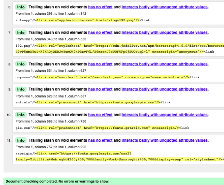

# Testing

[⏪ Main README](README.md)

## Contents

- [JavaScript/ JSX Testing](#javascript-jsx-testing)
    - [ESLint](#eslint)
        - [Install/ Run](#install-run)
    - [React Testing Library]()
        - [MSW]()
- [Html Validation]()
- [CSS Validation]()
- [Manual Testing]()
- [Screen Testing]()
- [Browser Testing]()
- [Lighthouse]()

## JavaScript/ JSX Testing

### ESLint
---
I tested the majority of the codebase using ESLint. After running the linter initially there were 3 errors, all of which were found in the `App.test.js`, and were due to there being an empty test. This was fixed by writing some simple tests within the file.

#### Install/ Run

As 'create-react-app' automatically installs ESLint it was already configured, however the configuration needed can be seen below. Lastly I added a line to the 'scripts' section in my package.json to define "lint" before running the linter

To install ESLint in the terminal:

    npm install eslint --save-dev

The `package.json` file extra configuration:

    "eslintConfig": {
        "extends": [
        "react-app",
        "react-app/jest"
        ]
    },

Extra line in 'scripts' section:

    "lint": "eslint ."

Finally to run the linter:

    npm run lint

[ESLint Docs](https://eslint.org/docs)

[⏫ contents](#contents)

### React Testing Library
---

#### Mock Service Worker

## Html Validation

In this particular application there is only one Html file, public/index.html. However it still needs to be validated, for this [W3C Validator](https://validator.w3.org/) was used. The file returned no warnings or errors just some 'info' regarding the trailing '/' as the JSX syntax was used.

## CSS Validation

The CSS files were all validated also using the 

CSS - w3cValidator

[⏪ Main README](README.md)

[⏫ contents](#contents)