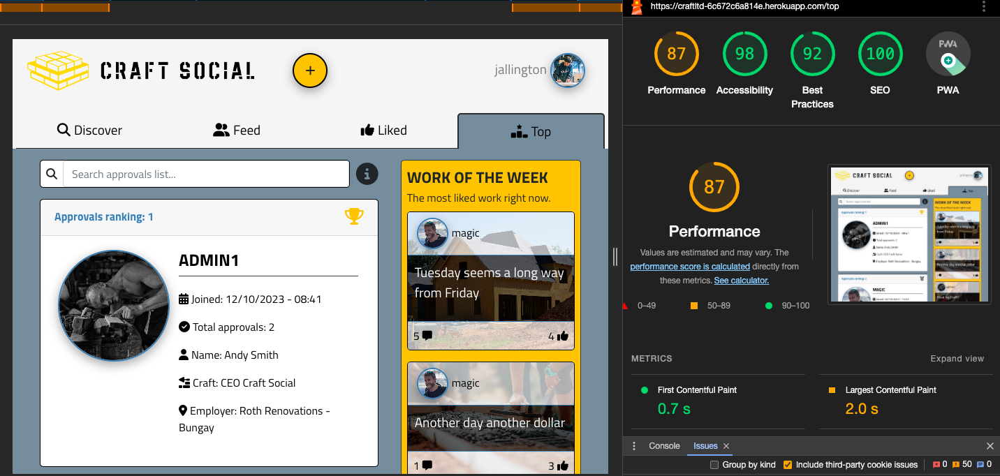

# Testing

[⏩ Main README](README.md)

[⏪ Craft-API Repository](https://github.com/mtmanning93/craft-api)

## Contents

-   [JavaScript/ JSX Testing](#javascript-jsx-testing)
    -   [ESLint](#eslint)
        -   [Install/ Run](#install-run-eslint)
    -   [Automated Testing](#automated-testing)
-   [Html Validation](#html-validation)
-   [CSS Validation](#css-validation)
    -   [Stylelint](#stylelint)
        -   [Install/ Run](#install-run-stylint)
-   [Manual Testing](#manual-testing)
    -   [Simulating Errors](#simulating-errors)
-   [WAVE Web Accessibility Testing](#wave-web-accessibility-testing)
-   [Screen Testing](#screen-testing)
-   [Browser Testing](#browser-testing)
-   [Lighthouse](#lighthouse)

## JavaScript/ JSX Testing

### ESLint

---

I tested the majority of the codebase using ESLint. After running the linter
initially there were 3 errors, all of which were found in the `App.test.js`, and
were due to there being an empty test. This was fixed by writing some simple
tests within the file.

#### Install/ Run Eslint

As 'create-react-app' automatically installs ESLint it was already configured,
however the configuration needed can be seen below. Lastly I added a line to the
'scripts' section in my package.json to define "lint" before running the linter

To install ESLint in the terminal:

    npm install eslint --save-dev

The `package.json` file extra configuration:

    "eslintConfig": {
        "extends": [
        "react-app",
        "react-app/jest"
        ]
    },

Extra line in 'scripts' section:

    "lint": "eslint ."

Finally to run the linter:

    npm run lint

[ESLint Docs](https://eslint.org/docs)

[⏫ contents](#contents)

### Automated Testing

---

Some simple automated tests were written using react testing library for the
Header, NavBar, and Post components, the written tests can be found in
`src/components/__tests__/<component>.test.js`.

The test setup mehtods including beforeAll(), afterEach(), and afterAll() can be
found in `src/setupTests.js`. With the test handlers found in
`src/mocks/handlers.js`.

In `handlers.js` I have defined necessary objects to simplify the tests, these
include:

-   **get user handler:** providing a test user object.
-   **post logout handler:** providing a logout method.
-   **get posts handler** providing a test posts list of post objects.
-   **post likes handler:** providing a like object.

The tests carried out are simple, mainly testing rendering, however they all
passed, they are as follows:

Test that the Header renders correctly for logged out users. Test that the
Header renders correct tabs and links to feeds for logged in users. Test NavBar
renders correct links for logged out users. Test NavBar renders link to profile
for a logged in user. Test NavBar renders 'login' and 'signup' link and button
when a user then logs out. Test Post renders the correct post details. Test that
the Post renders the post like button for logged in users. Test that the Post
component renders comment and like counts correctly. Test that the settings
dropdown menu is rendered for posts which a user owns.

[⏫ contents](#contents)

## Html Validation

In this particular application there is only one Html file, public/index.html.
However it still needs to be validated, for this
[W3C Validator](https://validator.w3.org/) was used. The file returned no
warnings or errors just some 'info' regarding the trailing '/' as the JSX syntax
was used.

[⏫ contents](#contents)

## CSS Validation

### Stylelint

---

All the CSS style files were validated using [Stylelint](https://stylelint.io/).
It makes the validating of many style sheets quick and easy. After installing
and setting the dependencies I was able to run the linter across all stylesheets
with one simple command.

After runnning the linter for the first time I had 1 error, which was easily
fixable in the `Buttons.module.css` file. The screenshot below shows the output
from Stylelint.

#### Install/ Run Stylint

To install Stylint I used the following command. To avoid setting up unecessary
configurations I used the 'stylelint-config-recommended' extension on the
command:

    npm install stylelint stylelint-config-recommended --save-dev

As the docs say the next step was to create a `.stylelintrc.json` file in the
root directory, inside I added the following:

    {
        "extends": "stylelint-config-recommended"
    }

Next I added yet another new line to the 'scripts' section of the package.json
file:

    "lint:css": "stylelint 'src/**/*.css'"

_(the src/\*\*/_.css basically means the linter will check any files ending in
.css in the src directory)\*

Finally to run the linter I could use the custom script command:

    npm run lint:css

[For more on getting started with Stylelint](https://stylelint.io/user-guide/get-started)

[⏫ contents](#contents)

## Manual Testing

Manual tests were created to test the functionality of the final deployed
version of the site, the outcomes were documented and displayed in the table
below. During the testing phase, occassionally tests would fail. If a test did
fail, the issue would be addressed accordingly and the outcome of the additional
testing would be provided with description of how it was fixed.

The related iterations seperate the tests and are linked to the related
iteration within the GitHub repository, all tests are mapped to their related
user stories, with an expected outcome and a test result following.

Finally these tests were carried out by a real user, as tests failed they would
be reported and dealt with after the testing with the current user. Once the
failed tests had been addressed they were again carried out on the same user,
this meant it was clear if the user experience was better as well as just
passsing the test.

| **Test**                                                                                                                   | **User Story**                                                                                 | **Expected Outcome**                                                                                                                                                                                       | **Initial Result**                                                                | **Action Taken To Pass _(if fail)_**                                                                                                                                                        |
| -------------------------------------------------------------------------------------------------------------------------- | ---------------------------------------------------------------------------------------------- | ---------------------------------------------------------------------------------------------------------------------------------------------------------------------------------------------------------- | --------------------------------------------------------------------------------- | ------------------------------------------------------------------------------------------------------------------------------------------------------------------------------------------- |
| **[Craft Front Iteration 1 (Navbar/ Registration)](https://github.com/mtmanning93/craft-front/milestone/3)**               |
| Click logo in navbar                                                                                                       | [Navigation #2](https://github.com/mtmanning93/craft-front/issues/2)                           | The main Navbar should include a logo to identify the site easily and quickly. It should be clickable as the main home link.                                                                               | Pass                                                                              | -                                                                                                                                                                                           |
| Click 'Home' link                                                                                                          | [Navigation #2](https://github.com/mtmanning93/craft-front/issues/2)                           | Clicking the 'Home' link in the logged out navbar should return a user to the home page.                                                                                                                   | Pass                                                                              | -                                                                                                                                                                                           |
| Navigate to the 'Signup' button                                                                                            | [Navigation #2](https://github.com/mtmanning93/craft-front/issues/2)                           | The signup button should be bright and easily findable to attract new users.                                                                                                                               | Pass                                                                              | -                                                                                                                                                                                           |
| Click 'Login' link                                                                                                         | [Login #8](https://github.com/mtmanning93/craft-front/issues/8)                                | Clicking the 'Login' link should direct a user to the login form.                                                                                                                                          | Pass                                                                              | -                                                                                                                                                                                           |
| Click the 'Dont have an account yet?' link                                                                                 | [Login #8](https://github.com/mtmanning93/craft-front/issues/8)                                | The user is redirected to the 'Signup' from.                                                                                                                                                               | Pass                                                                              | -                                                                                                                                                                                           |
| Enter invalid login data and submit form                                                                                   | [Login #8](https://github.com/mtmanning93/craft-front/issues/8)                                | The form validation errors should appear displaying necessary information.                                                                                                                                 | Pass                                                                              | -                                                                                                                                                                                           |
| Enter valid login data and submit form                                                                                     | [Login #8](https://github.com/mtmanning93/craft-front/issues/8)                                | The user is directed to the 'discover' feed, a success notification tells the user they have logged in.                                                                                                    | Pass                                                                              | -                                                                                                                                                                                           |
| After logging in click the avatar in the navbar                                                                            | [Navigation #2](https://github.com/mtmanning93/craft-front/issues/2)                           | Once login is uccessful the navbar switches to the logged in nav, displaying the create post button and an avatar dropdown, with links to 'Profile', 'Settings' and 'Logout'                               | Pass                                                                              | -                                                                                                                                                                                           |
| Click 'Signup' button                                                                                                      | [Signup #3](https://github.com/mtmanning93/craft-front/issues/3)                               | Clicking the 'Signup' button should direct a user to the signup form                                                                                                                                       | Pass                                                                              | -                                                                                                                                                                                           |
| Click the 'Already have an account?' link                                                                                  | [Signup #3](https://github.com/mtmanning93/craft-front/issues/3)                               | The user is redirected to the 'Login' from.                                                                                                                                                                | Pass                                                                              | -                                                                                                                                                                                           |
| Enter invalid signup data and submit form                                                                                  | [Signup #3](https://github.com/mtmanning93/craft-front/issues/3)                               | The form validation errors should appear displaying necessary information.                                                                                                                                 | Pass                                                                              | -                                                                                                                                                                                           |
| Enter valid login data and submit form                                                                                     | [Signup #3](https://github.com/mtmanning93/craft-front/issues/3)                               | The user is directed to the 'Login' form, logging in with new credentials logs user in as expected.                                                                                                        | Pass                                                                              | -                                                                                                                                                                                           |
| As a logged in user navigate to and click the logout link                                                                  | [Logout #12](https://github.com/mtmanning93/craft-front/issues/12)                             | The user is logged out, redirected to the 'Home' page, and a success message appears, additionally the navbar reverts to the logged out navbar.                                                            | Pass                                                                              | -                                                                                                                                                                                           |
| As a logged in user, select between the 4 different feeds by clicking the navigation tabs                                  | [Feed Navigation #27](https://github.com/mtmanning93/craft-front/issues/27)                    | On selection, the active tab is visible and the content represents the current tab features.                                                                                                               | Pass                                                                              | -                                                                                                                                                                                           |
| **[Craft Front Iteration 2 (Create Post/ Post Details)](https://github.com/mtmanning93/craft-front/milestone/4)**          |                                                                                                |                                                                                                                                                                                                            |                                                                                   | [⏫ contents](#contents)                                                                                                                                                                    |
| Navigate to and click the '+' create button in the navbar                                                                  | [Create Posts #9](https://github.com/mtmanning93/craft-front/issues/9)                         | The user is directed to the create post form.                                                                                                                                                              | Pass                                                                              | -                                                                                                                                                                                           |
| In the form do not enter any information, and submit form                                                                  | [Create Posts #9](https://github.com/mtmanning93/craft-front/issues/9)                         | Form validation error displayed on image file fields                                                                                                                                                       | Pass                                                                              | -                                                                                                                                                                                           |
| Add an image to the form, do not fill in the text fields, submit form                                                      | [Create Posts #9](https://github.com/mtmanning93/craft-front/issues/9)                         | Title validation error is displayed, 'This field may not be blank'.                                                                                                                                        | Pass                                                                              | -                                                                                                                                                                                           |
| After selecting an image file, click the 'change image file' text                                                          | [Create Posts #9](https://github.com/mtmanning93/craft-front/issues/9)                         | Users should be able to select and image file within the form and reselect if they wanted a different image.                                                                                               | Pass                                                                              | -                                                                                                                                                                                           |
| Fill in the title field with the image selected, submit form                                                               | [Create Posts #9](https://github.com/mtmanning93/craft-front/issues/9)                         | The post is saved and the user is directed to the 'Post Details' page of the newly created post.                                                                                                           | Pass                                                                              | -                                                                                                                                                                                           |
| Click on a post instance                                                                                                   | [Post Details #5](https://github.com/mtmanning93/craft-front/issues/5)                         | The user is redirected to the post detials page or the selected post.                                                                                                                                      | Pass                                                                              | -                                                                                                                                                                                           |
| Navigate back to the previous page, by clicking the 'return' button                                                        | [Post Details #5](https://github.com/mtmanning93/craft-front/issues/5)                         | A user is returned to the previous page.                                                                                                                                                                   | Pass                                                                              | -                                                                                                                                                                                           |
| Navigate to the authr detials of the post                                                                                  | [Post Details #5](https://github.com/mtmanning93/craft-front/issues/5)                         | A user should be able to easily identify the author and the profile details                                                                                                                                | Pass                                                                              | -                                                                                                                                                                                           |
| Find the comments count, and check it corresponds to number of comments                                                    | [Post Details #5](https://github.com/mtmanning93/craft-front/issues/5)                         | Comment count should convey the correct number of comments                                                                                                                                                 | Pass                                                                              | -                                                                                                                                                                                           |
| Navigate to the likes count                                                                                                | [Post Details #5](https://github.com/mtmanning93/craft-front/issues/5)                         | A visual representation of the number of likes per post is easily visible.                                                                                                                                 | Pass                                                                              | -                                                                                                                                                                                           |
| Hover over the comment icon                                                                                                | [Post Details #5](https://github.com/mtmanning93/craft-front/issues/5)                         | A tooltip should appear prompting the user to 'join the discussion below'.                                                                                                                                 | Pass                                                                              | -                                                                                                                                                                                           |
| Click on the settings menu on an owned post, then the 'edit' option                                                        | [Edit Post #10](https://github.com/mtmanning93/craft-front/issues/10)                          | A user is directed to the edit post form, rednered with relevant post details.                                                                                                                             | Pass                                                                              | -                                                                                                                                                                                           |
| In the edit form update the text fields                                                                                    | [Edit Post #10](https://github.com/mtmanning93/craft-front/issues/10)                          | The post is updated.                                                                                                                                                                                       | Pass                                                                              | -                                                                                                                                                                                           |
| In the edit form update image file                                                                                         | [Edit Post #10](https://github.com/mtmanning93/craft-front/issues/10)                          | The post is updated.                                                                                                                                                                                       | Pass                                                                              | -                                                                                                                                                                                           |
| In the edit form remove the text fields                                                                                    | [Edit Post #10](https://github.com/mtmanning93/craft-front/issues/10)                          | The form is not valid and does not submit.                                                                                                                                                                 | Pass                                                                              | -                                                                                                                                                                                           |
| As a logged out user hover over the like icon                                                                              | [Like/ Unlike #21](https://github.com/mtmanning93/craft-front/issues/21)                       | A tooltip should display prompting users to 'login or signup to llike posts'.                                                                                                                              | Pass                                                                              | -                                                                                                                                                                                           |
| As a logged in user hover over the like icon                                                                               | [Like/ Unlike #21](https://github.com/mtmanning93/craft-front/issues/21)                       | A tooltip should display prompting a user to 'like this post'.                                                                                                                                             | Fail - No tooltip shown                                                           | Pass - No tooltip was originally set, after setting a tooltip test passed.                                                                                                                  |
| As a logged in user hovers over the unlike icon                                                                            | [Like/ Unlike #21](https://github.com/mtmanning93/craft-front/issues/21)                       | A tooltip should display prompting a user to 'unlike this post'.                                                                                                                                           | Fail                                                                              | Pass - No tooltip was originally set, after setting a tooltip the test passed.                                                                                                              |
| As a logged in user click the like icon                                                                                    | [Like/ Unlike #21](https://github.com/mtmanning93/craft-front/issues/21)                       | The like button switches appearance to give the user a response and the like count increases by 1                                                                                                          | Pass                                                                              | -                                                                                                                                                                                           |
| As a logged in user click the unlike icon                                                                                  | [Like/ Unlike #21](https://github.com/mtmanning93/craft-front/issues/21)                       | The unlike button switches appearance to give the user a response and the like count decrease by 1                                                                                                         | Pass                                                                              | -                                                                                                                                                                                           |
| Navigate to the comments section                                                                                           | [View Comments #6](https://github.com/mtmanning93/craft-front/issues/6)                        | A comments section should be clearly visible underneath the post detials for all users to read.                                                                                                            | Pass                                                                              | -                                                                                                                                                                                           |
| Comment shows necessary information                                                                                        | [View Comments #6](https://github.com/mtmanning93/craft-front/issues/6)                        | Each comment displays the author details, avatar, date of comment and the comment itself.                                                                                                                  | Pass                                                                              | -                                                                                                                                                                                           |
| Submit invalid comment form by entering no information                                                                     | [Comment #19](https://github.com/mtmanning93/craft-front/issues/19)                            | No comment is posted and validation error is displayed                                                                                                                                                     | Pass                                                                              | -                                                                                                                                                                                           |
| Submit invalid data by adding just ' ' _(4 spaces)_ into the form                                                          | [Comment #19](https://github.com/mtmanning93/craft-front/issues/19)                            | No comment is posted and validation error is displayed                                                                                                                                                     | Pass                                                                              | -                                                                                                                                                                                           |
| Submit a valid form by leaving a comment                                                                                   | [Comment #19](https://github.com/mtmanning93/craft-front/issues/19)                            | The latest comment should appear at the top of the comments. No rerendering rquired.                                                                                                                       | Fail - Entire page rerenders                                                      | Pass - To prevent the rerendering the success message was removed as it didnt add to the user experience.                                                                                   |
| Navigate to the spanner icon and select delete from the dropdown                                                           | [Comment #19](https://github.com/mtmanning93/craft-front/issues/19)                            | On confirmation the users comment should be removed from the comment list.                                                                                                                                 | Pass                                                                              | -                                                                                                                                                                                           |
| Locate a post owned by the current user, navigate to the spanner dropdown and select 'delete'                              | [Delete Post #11](https://github.com/mtmanning93/craft-front/issues/11)                        | A delete confirmation modal should appear.                                                                                                                                                                 | Pass                                                                              | -                                                                                                                                                                                           |
| Confirm the post deletion.                                                                                                 | [Delete Post #11](https://github.com/mtmanning93/craft-front/issues/11)                        | The post is removed from the site, and the user is redirected to the previous page.                                                                                                                        | Pass                                                                              | -                                                                                                                                                                                           |
| **[Craft Social Front Iteration 3 (Post Feeds)](https://github.com/mtmanning93/craft-front/milestone/5)**                  |                                                                                                |                                                                                                                                                                                                            |                                                                                   | [⏫ contents](#contents)                                                                                                                                                                    |
| Navigate to the 'Home' feed                                                                                                | [Post List #4](https://github.com/mtmanning93/craft-front/issues/4)                            | As an unregistered user cou can see a full list of all site posts on the landing page.                                                                                                                     | Pass                                                                              | -                                                                                                                                                                                           |
| As a logged in user navigate to the 'Discover' feed                                                                        | [Post List #4](https://github.com/mtmanning93/craft-front/issues/4)                            | A full list of all site posts can be scrolled through ordered by most recent first.                                                                                                                        | Pass                                                                              | -                                                                                                                                                                                           |
| Click on the author details section with the avatar                                                                        | [Post List #4](https://github.com/mtmanning93/craft-front/issues/4)                            | Users are redirected to the profile of the author                                                                                                                                                          | Pass                                                                              | -                                                                                                                                                                                           |
| Click on the post image                                                                                                    | [Post List #4](https://github.com/mtmanning93/craft-front/issues/4)                            | Users are directed to the post detials page of the selected post.                                                                                                                                          | Pass                                                                              | -                                                                                                                                                                                           |
| As a logged in user navigate to the 'Feed' tab.                                                                            | [Followed Feed/ Feed #33](https://github.com/mtmanning93/craft-front/issues/33)                | The selected tab is visible and a message is displayed "No posts yet! You do not follow anybody.".                                                                                                         | Pass                                                                              | -                                                                                                                                                                                           |
| Follow another users profile, navigate back to the 'Feed' tab                                                              | [Followed Feed/ Feed #33](https://github.com/mtmanning93/craft-front/issues/33)                | The followed profiles posts can be seen in the feed                                                                                                                                                        | Pass                                                                              | -                                                                                                                                                                                           |
| Unfollow a profile then navigate to the 'Feed' tab.                                                                        | [Followed Feed/ Feed #33](https://github.com/mtmanning93/craft-front/issues/33)                | The unfollowed profile posts should not be found in the feed and the "No posts yet!" message is displayed.                                                                                                 | Pass                                                                              | -                                                                                                                                                                                           |
| Click the 'get started here' text link                                                                                     | [Followed Feed/ Feed #33](https://github.com/mtmanning93/craft-front/issues/33)                | The user should be redirected to the 'Discover' feed.                                                                                                                                                      | Pass                                                                              | -                                                                                                                                                                                           |
| As a logged in user navigate to the 'Liked' tab.                                                                           | [Liked Feed #32](https://github.com/mtmanning93/craft-front/issues/32)                         | The selected tab is visible and a message is displayed "No posts yet! You have not liked any posts".                                                                                                       | Pass                                                                              | -                                                                                                                                                                                           |
| Like a post, then navigate back to the 'Liked' tab                                                                         | [Liked Feed #32](https://github.com/mtmanning93/craft-front/issues/32)                         | The liked post can be seen in the feed.                                                                                                                                                                    | Pass                                                                              | -                                                                                                                                                                                           |
| Unlike a post you have previously liked, then navigate to the 'Liked' tab.                                                 | [Liked Feed #32](https://github.com/mtmanning93/craft-front/issues/32)                         | The unliked post should not be found in the feed and the "No posts yet!" message is displayed.                                                                                                             | Pass                                                                              | -                                                                                                                                                                                           |
| Click the 'get started here' text link                                                                                     | [Liked Feed #32](https://github.com/mtmanning93/craft-front/issues/32)                         | The user should be redirected to the 'Discover' feed.                                                                                                                                                      | Pass                                                                              | -                                                                                                                                                                                           |
| Scroll to the bottom of the feed                                                                                           | [Infinite Scroll #30](https://github.com/mtmanning93/craft-front/issues/30)                    | A spinner is displayed as more posts data loads, when the user has loaded all posts a message is displayed stating "no more posts to load"                                                                 | Pass                                                                              | -                                                                                                                                                                                           |
| Navigate to the 'Work of the Week' component                                                                               | [Top Posts 'WOTW' #13](https://github.com/mtmanning93/craft-front/issues/13)                   | Users should be easily able to find the 'Work of the Week' from any page of the site.                                                                                                                      | Pass                                                                              | -                                                                                                                                                                                           |
| Click on a post inside the 'Work of the Week' component.                                                                   | [Top Posts 'WOTW' #13](https://github.com/mtmanning93/craft-front/issues/13)                   | A user is directed to the relevant post detials page.                                                                                                                                                      | Pass                                                                              | -                                                                                                                                                                                           |
| Like a post from the WOTW list                                                                                             | [Top Posts 'WOTW' #13](https://github.com/mtmanning93/craft-front/issues/13)                   | The likes count should have incremented by one within the WOTW post.                                                                                                                                       | Pass                                                                              | -                                                                                                                                                                                           |
| Unlike a post from the WOTW list                                                                                           | [Top Posts 'WOTW' #13](https://github.com/mtmanning93/craft-front/issues/13)                   | The likes count should have decremented by one within the WOTW post.                                                                                                                                       | Pass                                                                              | -                                                                                                                                                                                           |
| Posts change depending like count                                                                                          | [Top Posts 'WOTW' #13](https://github.com/mtmanning93/craft-front/issues/13)                   | When a post is liked more than one of the posts in the WOTW component it swaps places ensuring the most liked posts are always ordered correctly.                                                          | Pass                                                                              | -                                                                                                                                                                                           |
| **[Craft Social Front Iteration 4 (Profile View)](https://github.com/mtmanning93/craft-front/milestone/6)**                |                                                                                                |                                                                                                                                                                                                            |                                                                                   | [⏫ contents](#contents)                                                                                                                                                                    |
| Click a profile avatar                                                                                                     | [Profile Pages #15](https://github.com/mtmanning93/craft-front/issues/15)                      | The avatars site wide should be a clickable link to the relevant profile details page.                                                                                                                     | Fail - In create post form                                                        | Pass - In post create form it isnt necessary for the Avatar to be a link as its a reference to the posts author.                                                                            |
| On a profile page scroll down to a profile specific post list                                                              | [Profile Pages #15](https://github.com/mtmanning93/craft-front/issues/15)                      | Every profile should have a posts feed filled with posts the profile has created.                                                                                                                          | Pass                                                                              | -                                                                                                                                                                                           |
| Check message for new profile                                                                                              | [Profile Pages #15](https://github.com/mtmanning93/craft-front/issues/15)                      | If a new profile has no posts yet the post list will display a "No posts yet!" message.                                                                                                                    | Pass                                                                              | -                                                                                                                                                                                           |
| Click the 'get started here' link                                                                                          | [Profile Pages #15](https://github.com/mtmanning93/craft-front/issues/15)                      | The user is directed to the create post form.                                                                                                                                                              | Pass                                                                              | -                                                                                                                                                                                           |
| Navigate to logged in profile, check post list title                                                                       | [Profile Pages #15](https://github.com/mtmanning93/craft-front/issues/15)                      | If the current user owns the profile the post list title will display 'Your Posts:'                                                                                                                        | Pass                                                                              | -                                                                                                                                                                                           |
| Navigate to another users profile, check post list title                                                                   | [Profile Pages #15](https://github.com/mtmanning93/craft-front/issues/15)                      | The title should display the profiles username like: '<username>'s Posts:'                                                                                                                                 | Pass                                                                              | -                                                                                                                                                                                           |
| Navigate to 'magic' users profile. Check all relevant personal details are visible                                         | [Profile Pages #15](https://github.com/mtmanning93/craft-front/issues/15)                      | The user should see all additional personal information displayed for 'magic', including: avatar, name, craft, employer, bio, joined date, owned companies.                                                | Pass                                                                              | -                                                                                                                                                                                           |
| Navigate to new user profile, check details.                                                                               | [Profile Pages #15](https://github.com/mtmanning93/craft-front/issues/15)                      | only username is visible from personal information                                                                                                                                                         | Fail - Personal detials heading displays                                          | Pass - Needed to update the conditional on the card footer to only display if the personal info fields had a value or if the profile companies array length was more than 0.                |
| Navigate to 'magic's' profile, check the profile counters display                                                          | [Profile Pages #15](https://github.com/mtmanning93/craft-front/issues/15)                      | Under the profile username 4 counter fields should display, posts count, approval count, follower, and following counts.                                                                                   | Pass                                                                              | -                                                                                                                                                                                           |
| Click the return button inside a profile page                                                                              | [Profile Pages #15](https://github.com/mtmanning93/craft-front/issues/15)                      | The user is returned to the previous page.                                                                                                                                                                 | Pass                                                                              | -                                                                                                                                                                                           |
| Click Follow button on a profile                                                                                           |  [Follow/ Unfollow #16](https://github.com/mtmanning93/craft-front/issues/16)                  |  The 'follow' button should switch to an 'unfollow' button with new appearance, the profiles follower count should increase by 1.                                                                          | Pass                                                                              | -                                                                                                                                                                                           |
| Check following count on user profile                                                                                      |  [Follow/ Unfollow #16](https://github.com/mtmanning93/craft-front/issues/16)                  |  When a user follows a profile their following count should increase by 1                                                                                                                                  | Pass                                                                              | -                                                                                                                                                                                           |
| Click Unfollow button on a profile                                                                                         |  [Follow/ Unfollow #16](https://github.com/mtmanning93/craft-front/issues/16)                  |  The 'unfollow' button should switch to the 'follow' button with new appearance, the profiles follower count should decrease by 1.                                                                         | Pass                                                                              | -                                                                                                                                                                                           |
| Check following count on user profile                                                                                      |  [Follow/ Unfollow #16](https://github.com/mtmanning93/craft-front/issues/16)                  |  When a user unfollows a profile their following count should decrease by 1                                                                                                                                | Pass                                                                              | -                                                                                                                                                                                           |
| Click Approve button on a profile                                                                                          |  [Profile Approval #23](https://github.com/mtmanning93/craft-front/issues/23)                  |  The 'approve' button should switch to an 'approved' button with new appearance, the profile approval count should increase by 1                                                                           | Pass                                                                              | -                                                                                                                                                                                           |
| Click Approved button on a profile                                                                                         |  [Profile Approval #23](https://github.com/mtmanning93/craft-front/issues/23)                  |  The 'approved' button should switch to an 'approve' button with new appearance, the profile approval count should decrease by 1                                                                           | Pass                                                                              | -                                                                                                                                                                                           |
|  Click the Profile link in the navbars avatar dropdown menu                                                                |  [User Profile #18](https://github.com/mtmanning93/craft-front/issues/18)                      |  The user is directed to their profile page.                                                                                                                                                               |  Pass                                                                             |  -                                                                                                                                                                                          |
| Access profile settings via the spanner dopdown menu                                                                       |  [User Profile #18](https://github.com/mtmanning93/craft-front/issues/18)                      |  Users can access the update profile form via the spanner dropdown menu on their profile, clicking the 'edit' option.                                                                                      |  Pass                                                                             |  -                                                                                                                                                                                          |
|  Test form validation                                                                                                      |  [Update Profile #22](https://github.com/mtmanning93/craft-front/issues/22)                    |  A user should be able to submit an empty form, meaning they can remove data they dont wish to share anymore.                                                                                              |  Pass                                                                             |  -                                                                                                                                                                                          |
|  Update profile image, select a new image for the avatar field                                                             |  [Update Profile #22](https://github.com/mtmanning93/craft-front/issues/22)                    |  On form submission the users profile image and avatar should change to the new image.                                                                                                                     |  Pass                                                                             |  -                                                                                                                                                                                          |
|  Update name field                                                                                                         |  [Update Profile #22](https://github.com/mtmanning93/craft-front/issues/22)                    |  The users profile card should now show personal details section with the updated name.                                                                                                                    |  Pass                                                                             |  -                                                                                                                                                                                          |
|  Update craft field                                                                                                        |  [Update Profile #22](https://github.com/mtmanning93/craft-front/issues/22)                    |  The users profile card should now show personal details section with the updated craft.                                                                                                                   |  Pass                                                                             |  -                                                                                                                                                                                          |
|  Update employer field                                                                                                     |  [Update Profile #22](https://github.com/mtmanning93/craft-front/issues/22)                    |  The users profile card should now show personal details section with the updated employer (and location if available).                                                                                    |  Pass                                                                             |  -                                                                                                                                                                                          |
|  Update bio field                                                                                                          |  [Update Profile #22](https://github.com/mtmanning93/craft-front/issues/22)                    |  The users profile card should now show personal details section with the updated bio.                                                                                                                     |  Pass                                                                             |  -                                                                                                                                                                                          |
|  Remove personal information field                                                                                         |  [Update Profile #22](https://github.com/mtmanning93/craft-front/issues/22)                    |  The users profile card should no longer show the relevant field                                                                                                                                           |  Pass                                                                             |  -                                                                                                                                                                                          |
|  Click the add company button                                                                                              |  [Employment Details #14](https://github.com/mtmanning93/craft-front/issues/14)                |  The user is redirected to the add company form.                                                                                                                                                           |  Pass                                                                             |  -                                                                                                                                                                                          |
|  Submit invalid add company form                                                                                           |  [Employment Details #14](https://github.com/mtmanning93/craft-front/issues/14)                |  Validation errors are raised as the minimum required data for a Company is a title.                                                                                                                       |  Pass                                                                             |  -                                                                                                                                                                                          |
|  Submit minimal details                                                                                                    |  [Employment Details #14](https://github.com/mtmanning93/craft-front/issues/14)                |  The user can add a company title and submit the form, redirected back to the update profile form with the new company visible in the 'Owned Companies' section.                                           |  Pass                                                                             |  -                                                                                                                                                                                          |
|  Submit all company field details                                                                                          |  [Employment Details #14](https://github.com/mtmanning93/craft-front/issues/14)                |  The user can add a company title and submit the form, redirected back to the update profile form with the new company visible in the 'Owned Companies' section. It shows all company detials applied.     |  Pass                                                                             |  -                                                                                                                                                                                          |
|  Check Owned Companies section displays correct information                                                                |  [Employment Details #14](https://github.com/mtmanning93/craft-front/issues/14)                |  The company details provided are shown in each company instance within the 'Owned Companies' seciton                                                                                                      |  Fail - Unused field icons are displayed with no data                             |  Pass - Updated conditional statements to only show icons if related company detilas are provided.                                                                                          |
|  Click the edit option in company settings dropdown, within the update profile form                                        |  [Employment Details #14](https://github.com/mtmanning93/craft-front/issues/14)                |  The user is directed to the edit company form where they can update the company information.                                                                                                              |  Pass                                                                             |  -                                                                                                                                                                                          |
|  Click the delete option in company settings dropdown, within the update profile form                                      |  [Employment Details #14](https://github.com/mtmanning93/craft-front/issues/14)                |  A confirmation modal is triggered to confirm the user wishes to delete the company, if confirmed the company instance is deleted, including from any user's employer field within their personal details. |  Pass                                                                             |  -                                                                                                                                                                                          |
|  Add company and select it as profiles employer instance                                                                   |  [Employment Details #14](https://github.com/mtmanning93/craft-front/issues/14)                |  Adding a new company adds it to the employer select dropdown menu.                                                                                                                                        |  Pass                                                                             |  -                                                                                                                                                                                          |
|  Delete a company, find it in the employer select dropdown                                                                 |  [Employment Details #14](https://github.com/mtmanning93/craft-front/issues/14)                |  The company is removed from the dropdown.                                                                                                                                                                 |  Fail - The company can still be found in dropdown until refresh                  |  Pass - Added a handleSelectCompanyChange function, passing it down to ProfileCompany.js as a prop and set the selected option according to company deletion.                               |
|  Set a company as employer, update profile. Navigate back to update profile form and delete this company.                  |  [Employment Details #14](https://github.com/mtmanning93/craft-front/issues/14)                |  The company is removed from the dropdown, and the users employer selection.                                                                                                                               |  Pass                                                                             |  -                                                                                                                                                                                          |
|  **[Craft Social Front Iteration 5 (Top Feed/ High Priorities)](https://github.com/mtmanning93/craft-front/milestone/7)**  |                                                                                                |                                                                                                                                                                                                            |                                                                                   | [⏫ contents](#contents)                                                                                                                                                                    |
| As a logged in user navigate to the 'Top' tab.                                                                             | [Top List #17](https://github.com/mtmanning93/craft-front/issues/17)                           | The selected tab is visible and a list of all profiles is displayed, ordered from most approved to least.                                                                                                  | Pass                                                                              | -                                                                                                                                                                                           |
|  View a profile details                                                                                                    |  [Top List #17](https://github.com/mtmanning93/craft-front/issues/17)                          |  A user can see a snapshot of the profiles in the list including: avatar, username, and personal detials added                                                                                             |  Pass                                                                             |  -                                                                                                                                                                                          |
|  View profiles approval ranking                                                                                            |  [Top List #17](https://github.com/mtmanning93/craft-front/issues/17)                          |  A user can see each profiles approval ranking in the top left of the profile card, in descending order from most approved to least.                                                                       |  Pass                                                                             |  -                                                                                                                                                                                          |
|  Click a profile card                                                                                                      |  [Top List #17](https://github.com/mtmanning93/craft-front/issues/17)                          |  A user is directed to the profile page of the clicked profile card                                                                                                                                        |  Pass                                                                             |  -                                                                                                                                                                                          |
|  As a logged in user navigate through the feeds, locate search bar                                                         |  [Search Bar #28](https://github.com/mtmanning93/craft-front/issues/28)                        |  The search bar is located at the top of all feeds.                                                                                                                                                        |  Pass                                                                             |  -                                                                                                                                                                                          |
|  Check search bar filters results search "Tuesday"                                                                         |  [Search Bar #28](https://github.com/mtmanning93/craft-front/issues/28)                        |  The search should filter the results in the feed to show only results containing "Tuesday".                                                                                                               |  Pass                                                                             |  -                                                                                                                                                                                          |
|  Search bar timeout                                                                                                        |  [Search Bar #28](https://github.com/mtmanning93/craft-front/issues/28)                        |  The search shouldnt return results for a second, this pause means the feed doesnt flash results back to the user.                                                                                         |  Pass                                                                             |  -                                                                                                                                                                                          |
|  Get a no results found message by typing "tttttttt"                                                                       |  [Search Bar #28](https://github.com/mtmanning93/craft-front/issues/28)                        |  A message should be displayed prompting the user to alter the search query                                                                                                                                |  Fail - The response is the no feed message                                       |  Pass - Added a condition to display noResultsMessage if no results are found after a search query, added across all feeds.                                                                 |
|  Filter approval list                                                                                                      |  [Approval Filters #17](https://github.com/mtmanning93/craft-front/issues/40)                  |  A user is able to filter through the approval list by job title, location, employer, username.                                                                                                            |  Pass                                                                             |  -                                                                                                                                                                                          |
|  Filter approval list, ranking change                                                                                      |  [Approval Filters #17](https://github.com/mtmanning93/craft-front/issues/40)                  |  A user is able to filter through the approval list, when filtered the profiles are rnaked in order within the filter.                                                                                     |  Pass                                                                             |  -                                                                                                                                                                                          |
|  Filter approval list by craft typing "Builder"                                                                            |  [Approval Filters #17](https://github.com/mtmanning93/craft-front/issues/40)                  |  Results shown in list are only builders, and ranked in order of approval count.                                                                                                                           |  Pass                                                                             |  -                                                                                                                                                                                          |
|  Filter approval list by location typing "Thetford"                                                                        |  [Approval Filters #17](https://github.com/mtmanning93/craft-front/issues/40)                  |  Results shown in list are only profiles in Thetford, and ranked in order of approval count.                                                                                                               |  Pass                                                                             |  -                                                                                                                                                                                          |
|  Filter approval list by employer typing "Pro Scapes"                                                                      |  [Approval Filters #17](https://github.com/mtmanning93/craft-front/issues/40)                  |  Results shown in list are only profiles employed by "Pro Scapes", and ranked in order of approval count.                                                                                                  |  Pass                                                                             |  -                                                                                                                                                                                          |
| Hover over the information icon                                                                                            |  [Approval Filters #17](https://github.com/mtmanning93/craft-front/issues/40)                  |  The user is prompted in the functionality of the approval list and explained how to search.                                                                                                               |  Pass                                                                             |  -                                                                                                                                                                                          |
|  Test a resource not found error by going to "/social" Url                                                                 |  [Custom Error Page #26](https://github.com/mtmanning93/craft-front/issues/26)                 |  The user is redirected to the page not found error page.                                                                                                                                                  |  Pass                                                                             |  -                                                                                                                                                                                          |
|  Test a resource not found error with a deleted resource by going to "/posts/2/" Url                                       |  [Custom Error Page #26](https://github.com/mtmanning93/craft-front/issues/26)                 |  The user is redirected to the page not found error page an error notification is displayed.                                                                                                               |  Pass                                                                             |  -                                                                                                                                                                                          |
|  Click the back button                                                                                                     |  [Custom Error Page #26](https://github.com/mtmanning93/craft-front/issues/26)                 |  The user is directed to the previous page.                                                                                                                                                                |  Fail - BackButton component will not work as the previous page cannot be found.  | Pass - Updated button to push to home, the failed result was because goBack() meant going back to a resource which is not there creating a loop between going back and the page not found.  |
|  As a logged in user attempt to navigate to the login form using '/login' url                                              |  [Redirecting Users Access Control #42](https://github.com/mtmanning93/craft-front/issues/42)  |  The user is redirected to the "/" (Discover feed) Url                                                                                                                                                     |  Pass                                                                             |  -                                                                                                                                                                                          |
|  As a logged in user attempt to navigate to the signup form using '/signup' url                                            |  [Redirecting Users Access Control #42](https://github.com/mtmanning93/craft-front/issues/42)  |  The user is redirected to the "/" (Discover feed) Url                                                                                                                                                     |  Pass                                                                             |  -                                                                                                                                                                                          |
|  As a logged out user attempt to access unauthorized content using "/profiles/1/edit/                                      |  [Redirecting Users Access Control #42](https://github.com/mtmanning93/craft-front/issues/42)  |  The user is redirected to the "/" Url with an error message telling the user this is restricted access                                                                                                    |  Pass                                                                             |  -                                                                                                                                                                                          |
|  As a logged out user attempt to access unauthorized content using "/posts/1/edit/                                         |  [Redirecting Users Access Control #42](https://github.com/mtmanning93/craft-front/issues/42)  |  The user is redirected to the "/" Url with an error message telling the user this is restricted access                                                                                                    |  Pass                                                                             |  -                                                                                                                                                                                          |
|  As a logged in user navigate to settings link in the avatar dropdown menu                                                 |  [Update Credentials #43](https://github.com/mtmanning93/craft-front/issues/43)                |  The user is directed to the update credential forms page.                                                                                                                                                 |  Pass                                                                             |  -                                                                                                                                                                                          |
|  Update username and submit username form                                                                                  |  [Update Credentials #43](https://github.com/mtmanning93/craft-front/issues/43)                |  The username is updated across the site, a success message is displayed, and the user is redirrected to the discover feed.                                                                                |  Pass                                                                             |  -                                                                                                                                                                                          |
|  Update password with valid data and submit password form                                                                  |  [Update Credentials #43](https://github.com/mtmanning93/craft-front/issues/43)                |  The password is updated, a success message is displayed, and the user is redirected to the discover feed.                                                                                                 |  Pass                                                                             |  -                                                                                                                                                                                          |
|  Update password with a common password "newpassword"                                                                      |  [Update Credentials #43](https://github.com/mtmanning93/craft-front/issues/43)                |  The password form is invalid and validation error is displayed on the form.                                                                                                                               |  Pass                                                                             |  -                                                                                                                                                                                          |
|  Update password with a non matching passwords                                                                             |  [Update Credentials #43](https://github.com/mtmanning93/craft-front/issues/43)                |  The password form is invalid and validation error is displayed on the form.                                                                                                                               |  Pass                                                                             |  -                                                                                                                                                                                          |
|  Click the cancel text link under the forms                                                                                |  [Update Credentials #43](https://github.com/mtmanning93/craft-front/issues/43)                |  User is redirected home                                                                                                                                                                                   |  Pass                                                                             |  -                                                                                                                                                                                          |
|  **Additional Features**  |                                                                                                |                                                                                                                                                                                                            |                                                                                   | [⏫ contents](#contents)                                                                                                                                                                    |
|  As a logged out user navigate to the Footer.                                                                               |  [Site Contact #7](https://github.com/mtmanning93/craft-front/issues/7)                |  User can easily and quickly find the Footer in all page components.                                                                                                                                                                                  |  Pass                                                                             |  -                                                                                                                                                                                          |
|  As a logged out user click the home link in the Footer.                                                                               |  [Site Contact #7](https://github.com/mtmanning93/craft-front/issues/7)                |  User is directed to the '/' url.                                                                                                                                                                                  |  Pass                                                                             |  -                                                                                                                                                                                          |
|  As a logged out user click the 'login' link in the Footer.                                                                               |  [Site Contact #7](https://github.com/mtmanning93/craft-front/issues/7)                |  User is directed to the '/login' form url.                                                                                                                                                                                  |  Pass                                                                             |  -                                                                                                                                                                                          |
|  As a logged out user click the 'signup' link in the Footer.                                                                               |  [Site Contact #7](https://github.com/mtmanning93/craft-front/issues/7)                |  User is directed to the '/signup' form url.                                                                                                                                                                                  |  Pass                                                                             |  -                                                                                                                                                                                          |
|  Login and scroll down to the Footer, click the 'Profile' link.                                                                               |  [Site Contact #7](https://github.com/mtmanning93/craft-front/issues/7)                |  User is directed to their profile page.                                                                                                                                                                                  |  Pass                                                                             |  -                                                                                                                                                                                          |
|  Login and scroll down to the Footer, click the 'Discover' link.                                                                               |  [Site Contact #7](https://github.com/mtmanning93/craft-front/issues/7)                |  User is directed to the '/' url.                                                                                                                                                                                  |  Pass                                                                             |  -                                                                                                                                                                                          |
|  Login and scroll down to the Footer, click the 'Logout' link.                                                                               |  [Site Contact #7](https://github.com/mtmanning93/craft-front/issues/7)                |  User is logged out and returned to the '/' url, Footer nav links return to logged out lnks.                                                                                                                                                                                  |  Pass                                                                             |  -                                                                                                                                                                                          |

[⏫ contents](#contents)

### Simulating Errors

---

When creating alerts to show the user incase of an error, I sometimes needed to
trigger the catch block. To do so I created a simple function to mock an error.
This way I was able to see the alerts play out in the case of an actual error.
Below is the simple function and function call I used throughout testing the
errors and the alerts.

    // outside useEffect()

    const simulateError = () => {
        throw new Error("Simulated error message");
    };

    // inside try block

    simulateError();

[⏫ contents](#contents)

## WAVE Web Accessibility Testing

WAVE testing was carried out to ensure accessibility was high. I used the WAVE
chrome browser plugin, its very simple and easy to use rendering the sites pages
with hints and errors marked, making them easy to address.

The goal of WAVE testing is to check the sites accessibility scores. When
testing the site the goal was to get 0 overall errors, and 0 contrast errors, to
reach this goal the following errors were addressed:

-   ### Missing Form Label

    Initially many `<Form.Control>` elements had no label for screenreaders, to
    combat this I had to add additional `<Form.Label>` elements with
    `className="sr-only"` and connect it to a `<Form.Control>` element via
    `htmlFor` attribute.

-   ### Link Contains No Text

    Related to the create post button in the navbar, to overcome this an
    `aria-label` was added to the link.

-   ### Empty Button

    Caused by having a Font Awesome icon as the button text. To fix this an
    `aria-label` was set on the MainButton and BackButton components.

-   ### Alt Text Missing On Update Images

    The issue was found in the edit object forms, for example the update profile
    form. The profile image to be updated need to have an `alt=""` text
    specified, additionally it needed to be more than one word to gove a
    relevant explanation.

-   ### Active NavLink Color Contrast
    Before the WAVE testing the active navlinks were bright yellow making the
    contrast too low, a simple update to a faded black color fixed this error.

[⏫ contents](#contents)

## Screen Testing

When designing the app and the UI, responsiveness was of high importance. Due to
the size of the project, and modularity of different components, I was able to
work on the responsivity of each component when it was developed, and maually
tested. When a component was used its parent component, in a form or 'page', I
utilized Chrome dev tools to aid in the responsive styling. Stacking components
on mobile devices. Using bootstraps grid system and some custom styling I was
able to implement a responsive design site-wide across a range of devices from
iPhone 6 to larger monitor sized screens.

To further test whether the app would work across screens I physically tested
its appearance across some devices of differing sizes, these were:

* 24" Monitor 19"
* Square Desktop 12"
* Macbook Air Laptop
* Samsung Galaxy s21

[⏫ contents](#contents)

## Browser Testing

The project was developed in Google Chrome using the Gitpod IDE. This made
building the project simple as I had access to the Chrome Devtools. It is
however not just available in the Chrome browser therefore it was important to
test it across a number of different browsers, the browser tests included:

* Chrome (Development)
* Firefox
* Edge

Finally I tested the browser compatability is Safari, worryingly it didnt work
as expected, when logging in to the site it just kept redirecting me back to the
login form, although the 'successful log' message was displayed each time. This
issue is due to the “Prevent Cross-Site Tracking” settings in safari. Whilst the
default is checked, to view the projects functionalities beyond login or signup
you must 'uncheck' this box, for use in safari.

On a desktop follow these steps:

1. Open site in Safari.

2. On iOS navigate to the safari 'preferences' settings.

    

3. Navigate to the 'Privacy' tab.

    

4. Uncheck the “Prevent Cross-Site Tracking” box.

    

[⏫ contents](#contents)

## Lighthouse

All site pages and forms underwent a Lighthouse test, the goal here was to get
all green scores, through; performance, accessibility, best practices and SEO.
The tests were carried out using Google Chrome with all browser pulgins switched
off.

After making some tweaks to some of the forms, pages and components I was able
to 'reach' 80 or higher in all of the categories, across all pages, in desktop
mode. Performance being the only category without a green (90<) score.

Initially when running lighthouse testing some performance scores were lower
than expected, to combat this I implemented these solutions:

-   `Serve images in next-gen formats`

    To begin with I used [Lint Images Bookmarklet](https://ausi.github.io/respimagelint/) to check for general common mistakes.

    When researching this warning I found cloudinary comes with built in
    'automatic format selection (`f_auto`) transformation parameter', to use
    this I needed to 'replace' the url string of the images used throughout the
    site. Posts and avatars are used and all needed to be rendered in next-gen
    formats, however webp format may not be cross compatible with a users
    device, this is where `f_auto` from Cloudinary comes in. By replacing part
    of the cloudinary image urls, cloudinary will automatically
    ['analyze the image content and select the best format to deliver. For example, it can automatically deliver images as WebP, AVIF or JPEG-2000 to browsers that support those formats'](https://cloudinary.com/documentation/image_optimization#how_to_optimize_image_format).

    here is an example of the replacement url, in use on the Avatar component
    (`src/componentsAvatar.js` _(line: 6)_):

          const avatarSrc = src ? src.replace("/upload/", "/upload/f_auto/") : null;

-   Minimise 'Largest-Contentful-Paint (LCD)'

    To optimise site performance and speed up the rendering of the images
    Cloudinary also have a similar solution using `q_auto`. It works the same as
    the above method, all you need to do is add it into the url seperating it
    from the `f-auto` with a comma. However this is for image quality, setting
    it to auto means
    ['Cloudinary's intelligent quality and encoding algorithm analyzes an image to find the best quality compression level and optimal encoding settings based on the image content and the viewing browser, in order to produce an image with good visual quality while minimizing the file size. '](https://cloudinary.com/documentation/image_optimization#automatic_quality_selection_q_auto).

          const avatarSrc = src ? src.replace("/upload/", "/upload/f_auto,q_auto/") : null;

-   `Explicitly set width and height on all images`

    Again the many images rendered throughout the site were slowing down the
    performance, setting explicit width and height attributes on the images
    significantly improved the performance scores.

Click the dropdowns below to see the lighthouse screenshots from each page:

Login Form Lighthouse Screenshots

Signup Form Lighthouse Screenshots

Discover Feed Lighthouse Screenshots

Feed Lighthouse Screenshots

Liked Feed Lighthouse Screenshots

Top Feed Lighthouse Screenshots

Create Post Form Lighthouse Screenshots

Edit Post Form Lighthouse Screenshots

Post Details Page Lighthouse Screenshots

Profile Page Lighthouse Screenshots

Update Profile Form Lighthouse Screenshots

Add Company Form Lighthouse Screenshots

Edit Company Form Lighthouse Screenshots

---

[⏫ contents](#contents)

[⏩ Main README](README.md)

[⏪ Craft-API Repository](https://github.com/mtmanning93/craft-api)
